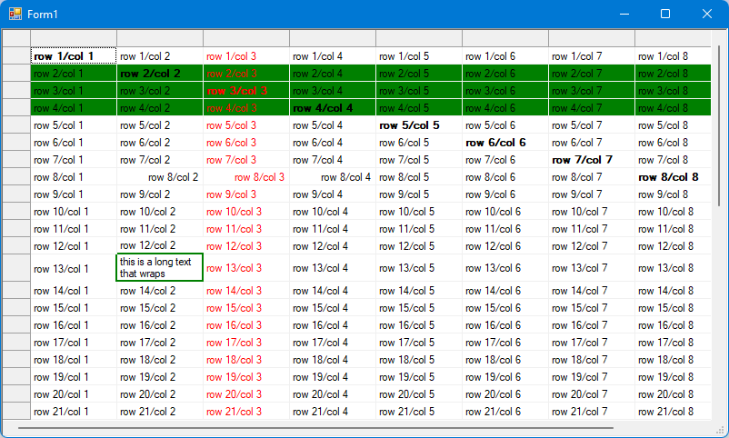

# C1FlexGrid enhancements: StyleHandler

This sample contains a helper class that simplies cell formatting of a ComponentOne C1FlexGrid (https://www.grapecity.com/componentone/winforms-ui-controls)

Normally, you set e.g. the BackColor of a cell this way:

~~~~
CellStyle styleWithBackColor = this.c1FlexGrid.Styles.Add("WithBackColor", this.c1FlexGrid.Styles.Normal);
styleWithBackColor.BackColor = Color.Red;
~~~~

Later, you apply this CellStyle to single cells:

~~~~
this.c1FlexGrid.SetCellStyle(row, col, styleWithBackColor);
~~~~

If you have a grid with a lot of colors, you have to create a style for each of them.
Combining this with ForeColor or font styles as bold or italic, you have to create a CellStyle
for each possible combination.

To simplify this, this sample contains a helper class `C1FlexGridStyleHandler`.

The result looks like this:

## How the style handler works
The StyleHandler is just a helper class to create CellStyle objects based on a formatting.
It calculates style names based on the formatting information, checks whether a style with this name is already
contained in the grid, and adds it if not.

The style names have this structure:
~~~~
<StyleElementFlags enum as integer>/<BackColor>/<BorderColor>/<BorderDirection>/<BorderStyle>/<BorderWidth>/<FontName>[Size]<FontStyle>/<TextAlignEnum as int>/<WordWrap>/<ImageAlignEnum as int>/<TextDirectionEnum as int>
~~~~

Only the modified values are contained in the string, so that it is much shorter if only the ForeColor is set.

If you first set the ForeColor ("styleHandler.MergeForeColor"), then the font ("styleHandler.MergeFont"), actually two styles are created:  
The first style is named "4/RR,GG,BB" (where "4" is `StyleElementFlags.ForeColor`, followed by the RGB value of the color)  
The second style is named "5/RR,GG,BB/Microsoft Sans Serif,[8,25],1" (where "5" is `StyleElementFlags.ForeColor | StyleElementFlags.Font`).  
The first style might be unused.

The style handler internally builds a dictionary of style name to grid style. This is more performant then doing a lookup
in the `C1FlexGrid.Styles` collection. But it has the drawback that you should not modify the "Styles" collection
yourself, as the internal dictionary might become invalid.

## Usage of "C1FlexGridStyleHandler"
### Creation
To use it:
Define a variable anywhere (local variable in method or member variable):
~~~~
C1FlexGridStyleHandler styleHandler = new C1FlexGridStyleHandler(this.c1FlexGrid1);
~~~~

### Merge/Set styles
The `Merge...` methods are used if you want to combine formattings. To set BackColor and Font,
you call `MergeBackColor` and `MergeFont`. The order of those calls is not relevant.

The `Set...` methods are used, if you want to remove any formatting

In most situations, `Merge...` works perfectly, no need to use `Set...`.

Here is the code of the sample that created the screenshot:
~~~~
//Three rows with green backcolor
styleHandler.MergeBackColor(2, 1, 4, this.c1FlexGrid1.Cols.Count - 1, Color.Green);
//one column with red forecolor:
styleHandler.MergeForeColor(1, 3, this.c1FlexGrid1.Rows.Count - 1, 3, Color.Red);

//Some bold cells:
for (int col = this.c1FlexGrid1.Cols.Fixed; col < this.c1FlexGrid1.Cols.Count; col++)
{
  styleHandler.MergeFont(col, col, new Font(this.c1FlexGrid1.Font, FontStyle.Bold));
}

//align text vertical:
styleHandler.MergeTextAlign(8, 2, TextAlignEnum.RightCenter);
styleHandler.MergeTextAlign(8, 3, TextAlignEnum.RightCenter);
styleHandler.MergeTextAlign(8, 4, TextAlignEnum.RightCenter);

//Word Wrap:
//We have to set a longer  text:
this.c1FlexGrid1[13, 2] = "this is a long text that wraps";
styleHandler.MergeWordWrap(13, 2,true);
//AutoSizeRows is called later.

//Apply a border to this cell.
//To archive this, we have to set the bottom border of the cell above and the right border of the cell to the left.
//Unfortunately, the cell to the left looses the bottom border, and the cell above has no right border - better use my "BorderPainter" sample.
styleHandler.MergeBorder(13, 2, Color.Green, BorderDirEnum.Both, BorderStyleEnum.Flat, 2);
styleHandler.MergeBorder(12, 2, Color.Green, BorderDirEnum.Horizontal, BorderStyleEnum.Flat, 2);
styleHandler.MergeBorder(13, 1, Color.Green, BorderDirEnum.Vertical, BorderStyleEnum.Flat, 2);

//Auto size the row - do this after applying the border, as the border width "2" affects the row height:
this.c1FlexGrid1.AutoSizeRow(13);
~~~~
