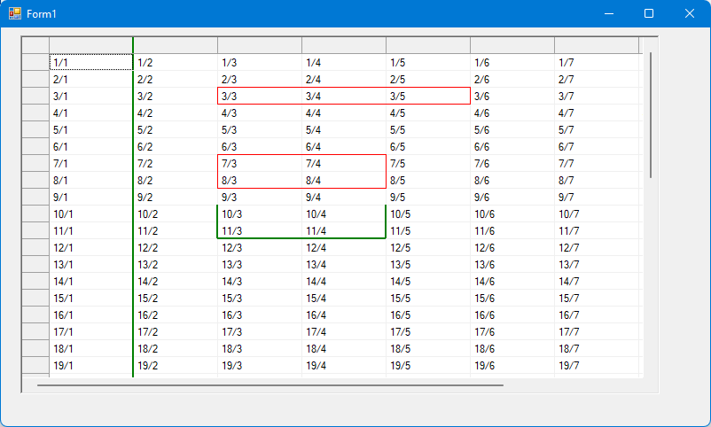

# C1FlexGrid enhancements: BorderPainter (.NET 4.8)

This sample shows a way to define custom borders in a ComponentOne C1FlexGrid (https://www.grapecity.com/componentone/winforms-ui-controls)

This sample uses the C1 dlls for .NET 4.8. A version for .NET6 is here: [C1FlexGrid6BorderPainter](/C1FlexGrid6BorderPainter)

Normally, you create borders this way:

~~~~
CellStyle styleWithBorder = this.c1FlexGrid.Styles.Add("WithBorder", this.c1FlexGrid.Styles.Normal);
styleWithBorder.Border.Style = BorderStyleEnum.Flat;
styleWithBorder.Border.Color = Color.Red;
styleWithBorder.Border.Width = 2;
styleWithBorder.Border.Direction = BorderDirEnum.Both;
~~~~

This style has a border to the right and the bottom, with red lines of width "2".

Later, you apply this CellStyle to single cells:

~~~~
this.c1FlexGrid.SetCellStyle(row, col, styleWithBorder);
~~~~

You have to set the style to each single cell.
The border applies only to the right/bottom border of a cell. To create a top border, you have to create a style with only bottom border ("Border.Direction = BorderDirEnum.Horizontal") and set this style to the cell above the current cell.
Same for a left border: create a style with only a right border ("Border.Direction = BorderDirEnum.Vertical") and set this style to the cell left to the current cell.

This approach has the limitation that you cannot use different border types for left and bottom border of the cell.

To simplify this (and overcome the limitation), this sample contains a helper class "C1FlexGridBorderPainter".

The result looks like this:

## Usage of "C1FlexGridBorderPainter"
To use it:
Define a membervariable of your form/usercontrol. The sample uses creates two different borders and thus creates two border painter:
~~~~
private C1FlexGridBorderPainter borderPainterRed;
private C1FlexGridBorderPainter borderPainterGreen;
~~~~

Initialize it somewhere in your code:
Provide the C1FlexGrid and a Pen in the constructor call.
Then, you have to tell the border painter how many rows/cols the grid has.
~~~~
//Create border painter with red border:
this.borderPainterRed = new C1FlexGridBorderPainter(this.c1FlexGrid, Pens.Red);
this.borderPainterRed.ResetGrid(this.c1FlexGrid.Rows.Count, this.c1FlexGrid.Cols.Count);

//Create border painter with green border and width "2 pixel":
Pen penGreen = new Pen(Color.Green, 2);
this.borderPainterGreen = new C1FlexGridBorderPainter(this.c1FlexGrid, penGreen);
this.borderPainterGreen.ResetGrid(this.c1FlexGrid.Rows.Count, this.c1FlexGrid.Cols.Count);
~~~~

If you add rows/cols to the grid or remove them, the borderpainter does not detect it itself - so call "ResetGrid" again or 
call "InsertRows"/"RemoveRows"/"InsertCols"/"RemoveCols".

If you refill the grid with different data, call "ResetGrid", which resets all borders.

Next, define some borders:

~~~~
this.borderPainterRed.SetBorders(3, 3, 3, 5);
this.borderPainterRed.SetBorders(7, 3, 8, 4);

//This is just a right border (which means: a vertical line)
this.borderPainterGreen.SetBorders(0, 1, this.c1FlexGrid.Rows.Count - 1, 1, BorderType.Right);

//And another partial border:
this.borderPainterGreen.SetBorders(10, 3, 11, 4, BorderType.Right | BorderType.Left | BorderType.Bottom);
~~~~

Then, active owner drawing for the grid:
~~~~
this.c1FlexGrid.DrawMode = C1.Win.C1FlexGrid.DrawModeEnum.OwnerDraw;
this.c1FlexGrid.OwnerDrawCell += c1FlexGrid_OwnerDrawCell;
~~~~

In der "c1FlexGrid_OwnerDrawCell", make the border painter calls:
~~~~
private void c1FlexGrid_OwnerDrawCell(object sender, C1.Win.C1FlexGrid.OwnerDrawCellEventArgs e)
{
  //First draw the cell:
  e.DrawCell();

  //Then draw our borders:
  //Note: if border from two border painter might overlap, the latest border will win:
  this.borderPainterRed.DrawBorders(e);
  this.borderPainterGreen.DrawBorders(e);
}
~~~~

## Disposing of Pen objects
If you create custom pens, you should dispose them (e.g. the green Pen in my sample). So store them in a member variable
and dispose them when the Form / UserControl is disposed.
